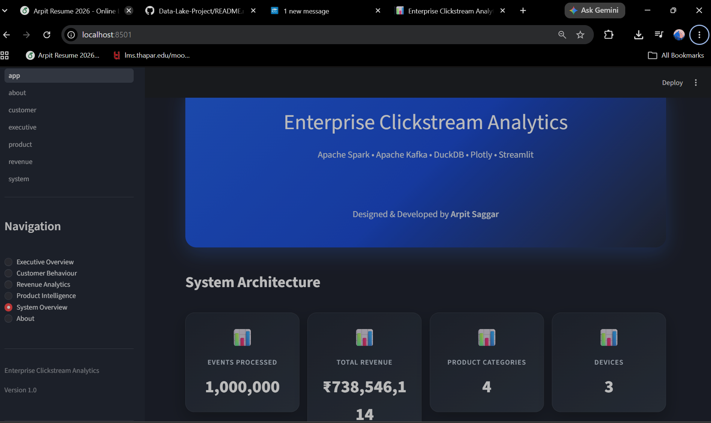

# Enterprise Clickstream Data Lake - By Arpit Saggar

A scalable end-to-end **Data Lake pipeline** for processing, transforming, and analyzing high-volume clickstream data using **Python, Apache Kafka, Apache Spark, Parquet, DuckDB, and Streamlit**.

The project follows a **Bronze → Silver → Gold** architecture, separating raw ingestion data from cleaned/processed data and analytics-ready datasets.

---
# How the Local Website looks like : 
<h2 align="center">Enterprise Clickstream Analytics Dashboard</h2>

<p align="center">
  
</p>

## Architecture

```text
                    ┌─────────────────────┐
                    │   Data Generator    │
                    │  Synthetic Events   │
                    └──────────┬──────────┘
                               │
                               ▼
                    ┌─────────────────────┐
                    │   Apache Kafka      │
                    │ Event Streaming     │
                    └──────────┬──────────┘
                               │
                               ▼
              ┌──────────────────────────────┐
              │        BRONZE LAYER          │
              │      Raw Event Data          │
              │        Parquet               │
              └──────────────┬───────────────┘
                             │
                             ▼
              ┌──────────────────────────────┐
              │         APACHE SPARK         │
              │ Cleaning & Transformation    │
              └──────────────┬───────────────┘
                             │
                             ▼
              ┌──────────────────────────────┐
              │         SILVER LAYER         │
              │ Cleaned & Structured Data    │
              │        Parquet               │
              └──────────────┬───────────────┘
                             │
                             ▼
              ┌──────────────────────────────┐
              │         APACHE SPARK         │
              │ Aggregation & Enrichment     │
              └──────────────┬───────────────┘
                             │
                             ▼
              ┌──────────────────────────────┐
              │          GOLD LAYER          │
              │ Analytics-Ready Datasets     │
              │        Parquet               │
              └──────────────┬───────────────┘
                             │
                             ▼
                    ┌─────────────────────┐
                    │      DuckDB        │
                    │ Analytical Queries │
                    └──────────┬──────────┘
                               │
                               ▼
                    ┌─────────────────────┐
                    │    Streamlit        │
                    │    Dashboard        │
                    └─────────────────────┘
